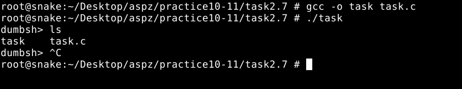

## ЗАВДАННЯ З ЛЕКЦІЇ №2.3 :
### Пояснення та опис програми:
### Результати:

### [Код завдання](task2.3/task.c)

## ЗАВДАННЯ З ЛЕКЦІЇ №2.4 :
### Пояснення та опис програми:
### Результати:

### [Код завдання](task2.4/task.c)

## ЗАВДАННЯ З ЛЕКЦІЇ №2.5 :
### Пояснення та опис програми:
### Результати:

### [Код завдання](task2.5/task.c)

## ЗАВДАННЯ З ЛЕКЦІЇ №2.6 :
### Пояснення та опис програми:
### Результати:

### [Код завдання](task2.6/task.c)

## ЗАВДАННЯ З ЛЕКЦІЇ №2.7 :
### Пояснення та опис програми:
### Результати:

### [Код завдання](task2.7/task.c)

## ЗАВДАННЯ З ЛЕКЦІЇ №2.9 :
### Пояснення та опис програми:
### Результати:

### [Код завдання](task2.9/task.c)

## ЗАВДАННЯ З ЛЕКЦІЇ №2.10:
### Пояснення та опис програми:
### Результати:

### [Код завдання](task2.10/task.c)

## ЗАВДАННЯ З ЛЕКЦІЇ №2.11 :
### Пояснення та опис програми:
### Результати:

### [Код завдання](task2.11/task.c)

## ПЕРСОНАЛЬНЕ ЗАВДАННЯ, ВАРІАНТ №14 :
### Пояснення та опис програми:
### Результати:

/1.png)
### [Код завдання](task(V14)/task.c)

