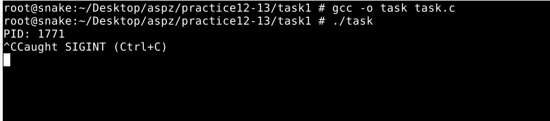
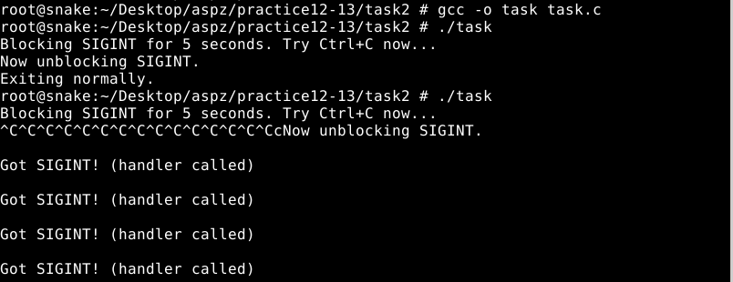
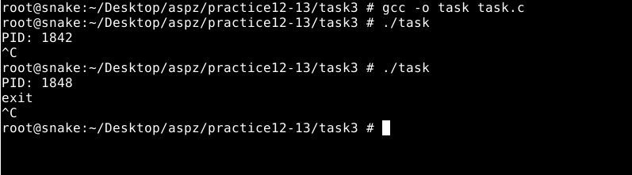
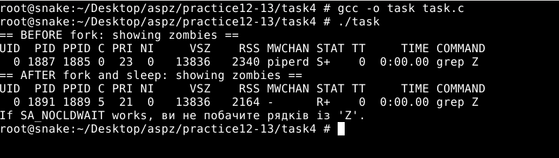
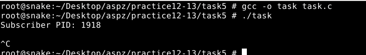
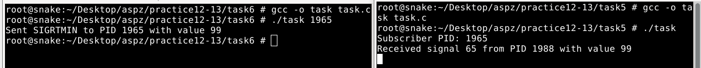

## ЗАВДАННЯ З ЛЕКЦІЇ №1:
### Пояснення та опис програми:
Програма встановлює обробники сигналів SIGINT і SIGTERM. Спочатку викликається signal(SIGINT, handle_sigint), який при натисненні Ctrl+C виводить «Caught SIGINT (Ctrl+C)», а signal(SIGTERM, handle_sigterm) — при отриманні SIGTERM виводить «Caught SIGTERM, exiting…» та завершує процес. Далі програма виводить свій PID і заходить у нескінченний цикл sleep(1). Таким чином при Ctrl+C користувач побачить повідомлення про перехоплений SIGINT, а при надходженні SIGTERM — повідомлення та завершення роботи.
### Результати:

### [Код завдання](task1/task.c)

## ЗАВДАННЯ З ЛЕКЦІЇ №2 :
### Пояснення та опис програми:
Програма спочатку повідомляє «Blocking SIGINT for 5 seconds. Try Ctrl+C now…» і встановлює власний обробник для сигналу SIGINT. Далі вона блокує SIGINT на п’ять секунд – тобто якщо ви натискаєте Ctrl+C, нічого не стається до розблокування. Після п’яти секунд програма виводить «Now unblocking SIGINT.», розблоковує сигнал і дає йому час спрацювати: якщо натискали Ctrl+C, одразу викликається обробник, який друкує «Got SIGINT! (handler called)» стільки разів, скільки разів був сигнал. Потім через кілька секунд вона виводить «Exiting normally.» і завершується.
### Результати:

### [Код завдання](task2/task.c)

## ЗАВДАННЯ З ЛЕКЦІЇ №3 :
### Пояснення та опис програми:
Програма встановлює спеціальний обробник для користувацького сигналу SIGUSR1 за допомогою структури sigaction. В обробнику функція handler приймає три аргументи: номер сигналу, вказівник на siginfo_t, звідки можна дізнатися PID відправника, і контекст. Флаг SA_SIGINFO дає доступ до info->si_pid, а SA_RESTART автоматично перезапускає заблоковані системні виклики після обробки сигналу. Після налаштування програма виводить власний PID і заходить у нескінченний цикл викликів pause(), очікуючи сигнал. Коли приходить SIGUSR1, у консолі з’являється повідомлення виду
Caught signal 10 from PID 1234, де 10 — номер SIGUSR1, а 1234 — PID процесу-відправника.
### Результати:

### [Код завдання](task3/task.c)

## ЗАВДАННЯ З ЛЕКЦІЇ №4 :
### Пояснення та опис програми:
Програма налаштовує поведінку для сигналу SIGCHLD так, щоб автоматично ігнорувати завершені дочірні процеси і не створювати «зомбі». Спочатку через sigaction задається sa_handler = SIG_IGN і прапорець SA_NOCLDWAIT – це означає, що ядро не буде залишати інформацію про дочірні процеси після їх завершення. Далі виводиться список зомбі-процесів до fork(), потім створюється дочірній процес, який відразу завершується. Після короткої паузи sleep(1) знову показується список зомбі: якщо SA_NOCLDWAIT спрацював, рядків зі статусом Z не буде. Таким чином демонструється, як за допомогою ігнорування SIGCHLD і SA_NOCLDWAIT можна автоматично «прибирати» дочірні процеси без необхідності викликів wait().
### Результати:

### [Код завдання](task4/task.c)

## ЗАВДАННЯ З ЛЕКЦІЇ №5 :
### Пояснення та опис програми:
Програма працює як «підписник» на реальні сигнали SIGRTMIN. Спочатку задається структура sigaction з прапором SA_SIGINFO і вказівником на обробник handler, який при отриманні сигналу виводить номер сигналу, PID відправника (info->si_pid) та значення повідомлення (info->si_value.sival_int). Після виклику sigaction програма виводить свій PID («Subscriber PID: …») і заходить у нескінченний цикл pause(), очікуючи сигнал. Коли інший процес надішле SIGRTMIN через sigqueue() із числовим значенням, handler спрацює й покаже у консолі інформацію про відправника та передане значення.
### Результати:

### [Код завдання](task5/task.c)

## ЗАВДАННЯ З ЛЕКЦІЇ №6 :
### Пояснення та опис програми:
Програма приймає в аргументах командного рядка PID іншого процесу-«підписника», формує об’єкт union sigval зі значенням 99 і викликає sigqueue(pid, SIGRTMIN, val). У разі успіху вона виводить
Sent SIGRTMIN to PID <номер> with value 99
і завершується. Якщо sigqueue повертає помилку, замість цього виводиться повідомлення perror. Так реалізується відправка реального сигналу SIGRTMIN із цілочисельним повідомленням іншому процесу.
### Результати:

### [Код завдання](task6/task.c)

## ПЕРСОНАЛЬНЕ ЗАВДАННЯ, ВАРІАНТ №14 :
### Умова: Напишіть програму, яка посилає реальні сигнали з таймером (timer_create) і аналізує, скільки з них реально оброблено, а скільки загублено.
### Пояснення та опис програми:
Програма створює високочастотний POSIX-таймер, який надсилає реальний сигнал SIGRTMIN кожну мілісекунду протягом двох секунд. При кожному спрацьовуванні таймера виконується обробник handler, який підраховує всі отримані сигнали (з урахуванням пропущених через «переповнення» таймера) та кількість фактично оброблених викликів. Після двох секунд таймер зупиняється, дається ще секунда на обробку останніх сигналів, а потім у консоль виводяться три значення: загальна кількість надісланих сигналів (з урахуванням overruns), кількість викликів обробника та різниця між ними — втрачені сигнали. Цей приклад показує, як вимірювати пропускну спроможність обробки сигналів у Linux.
### Результати:

/1.png)
### [Код завдання](task(V14)/task.c)

