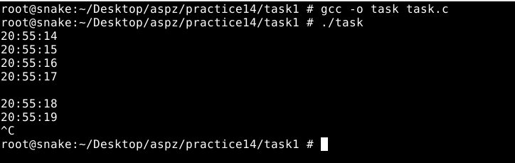
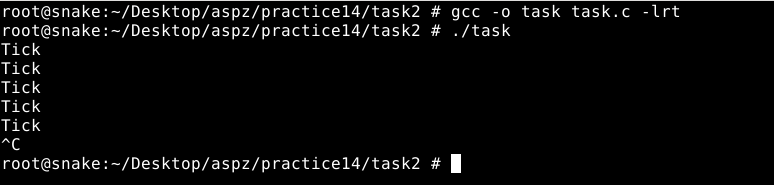

## ЗАВДАННЯ З ЛЕКЦІЇ №1:
### Пояснення та опис програми:
Ця програма встановлює обробник сигналу SIGALRM, який при спрацьовуванні виводить поточний час у форматі ГГ:ХХ:СС. У функції main спочатку виконується signal(SIGALRM, handler), а потім виклик alarm(1), щоб через секунду надійшов сигнал SIGALRM. Після цього програма заходить у нескінченний цикл pause(), чекаючи сигналів. У handler за допомогою time() і localtime() отримується поточний час, форматування здійснюється через strftime(), а потім результат виводиться на екран через write(). Після кожного виводу handler повторно викликає alarm(1), тому в консолі кожну секунду з’являється новий рядок із часом.
### Результати:

### [Код завдання](task1/task.c)

## ЗАВДАННЯ З ЛЕКЦІЇ №2:
### Пояснення та опис програми:
Програма встановлює POSIX-таймер, який надсилає кожну секунду реальний сигнал SIGRTMIN. Спочатку через signal(SIGRTMIN, handler) задається обробник, який у відповідь на сигнал викликає write() і виводить “Tick” із нового рядка. Потім створюється таймер (timer_create) із початковою затримкою 1 с і інтервалом 1 с (timer_settime). Нарешті, програма заходить у нескінченний цикл pause(), чекаючи сигналів. Відтак щосекунди на екрані з’являється слово “Tick”, демонструючи роботу високоточних POSIX-таймерів.
### Результати:

### [Код завдання](task2/task.c)

## ПЕРСОНАЛЬНЕ ЗАВДАННЯ, ВАРІАНТ-14:
### Умова:
Створіть гру-реакцію (reaction time game), яка вимірює час реакції користувача на появу сигналу з таймера.
### Пояснення та опис програми:
Програма вимірює вашу швидкість реакції. Спочатку задається обробник для сигналу SIGALRM, який у момент спрацьовування фіксує час старту й виводить «GO!». Потім генерується випадкова затримка від 2 до 5 секунд і виводиться «Get ready… waiting for GO signal». Виклик alarm запускає таймер, а pause чекає на сигнал. Коли час вийшов, обробник зберігає час початку, повідомляє GO і дозволяє програмі далі чекати. Після цього програма чекає натискання Enter, фіксує час закінчення, обчислює різницю між початком і кінцем у секундах і виводить «Reaction time: … seconds».
### Результати:

/1.png)
### [Код завдання](task(V14)/task.c)
