## ЗАВДАННЯ 1:

### Умова:

Напишіть програму для визначення моменту, коли time_t закінчиться. Дослідіть, які зміни відбуваються в залежності від 32- та 64-бітної архітектури. Дослідіть сегменти виконуваного файлу.


### Пояснення та опис програми:

Ця програма спочатку обчислює максимальне значення time_t на вашій системі, зсуваючи одиницю на розрядність мінус один і віднімаючи одиницю, після чого відображає його як звичну дату за допомогою ctime. Потім до цього граничного значення додається одиниця, щоб показати переповнення і некоректний відлік часу. На 32‑бітних платформах ліміт настає 19 січня 2038 року, а на 64‑бітних межа знаходиться в мільярдах років. Додатково можна за допомогою readelf -S чи objdump -h подивитися секції ELF‑файлу та зрозуміти, як розподілені код, константи та змінні у виконуваному файлі.

### Результати:

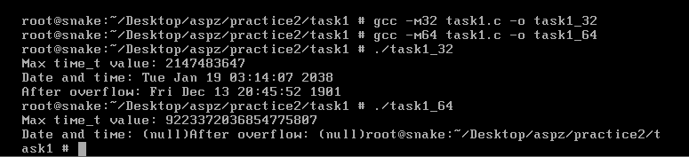
### [Код завдання](task1/task1.c)


## ЗАВДАННЯ 2:

### Умова:

Розгляньте сегменти у виконуваному файлі.

1. Скомпілюйте програму &quot;hello world&quot;, запустіть ls -l для виконуваного файлу, щоб отримати його загальний розмір, і запустіть size, щоб отримати розміри сегментів всередині нього.
2. Додайте оголошення глобального масиву із 1000 int, перекомпілюйте й повторіть вимірювання. Зверніть увагу на відмінності.
3. Тепер додайте початкове значення в оголошення масиву (пам’ятайте, що C не змушує вас вказувати значення для кожного елемента масиву в ініціалізаторі). Це перемістить масив із сегмента BSS у сегмент даних. Повторіть вимірювання. Зверніть увагу на різницю.
4. Тепер додайте оголошення великого масиву в локальну функцію. Оголосіть другий великий локальний масив з ініціалізатором. Повторіть вимірювання. Дані розташовуються всередині функцій, залишаючись у виконуваному файлі? Яка різниця, якщо масив ініціалізований чи ні?
5. Які зміни відбуваються з розмірами файлів і сегментів, якщо ви компілюєте для налагодження? Для максимальної оптимізації?

Проаналізуйте результати, щоб переконатися, що:

● сегмент даних зберігається у виконуваному файлі;

● сегмент BSS не зберігається у виконуваному файлі (за винятком примітки щодо його вимог до розміру часу виконання);

● текстовий сегмент більшою мірою піддається перевіркам оптимізації;

● на розмір файлу a.out впливає компіляція для налагодження, але не сегменти.


### Пояснення програми:

Спочатку компілюєте “hello world”, дивитесь ls і size – сегменти .data й .bss пусті. Додаєте глобальний масив без ініціалізації – зростає BSS у size, але файл не збільшується. Ініціалізований масив переходить у .data, і файл більшає. Локальні масиви впливають лише на стек. -g додає дебаг, -O2 зменшує текст.

### Результат роботи:

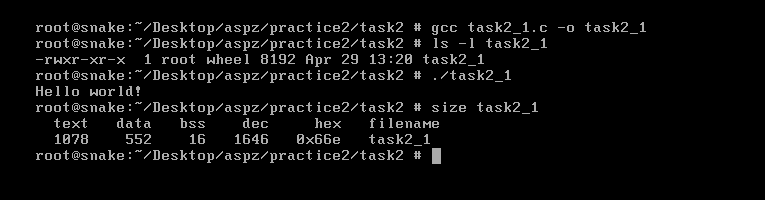
### [Код завдання](task2/task2_1.c)


### Пояснення програми:

Коли ви оголошуєте глобальний масив без ініціалізації, він потрапляє до сегмента BSS, який не зберігається в бінарному файлі, а лише резервується під час запуску. Тому розмір виконуваного файлу майже не змінюється, однак обсяг оперативної пам’яті, необхідний для виконання, зростає відповідно до розміру масиву. При завантаженні ОС виділяє й зануляє пам’ять.

### Результат роботи:

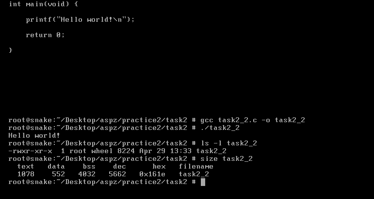
### [Код завдання](task2/task2_2.c)


### Пояснення програми:

Коли глобальний масив оголошується з початковими значеннями, він переходить із сегмента .bss у сегмент .data. Сегмент .data фізично зберігається в бінарному файлі, тому розмір виконуваного файлу зростає на загальний обсяг даних масиву. При завантаженні ОС виділяє пам’ять та ініціалізує її заданими значеннями. Це можна підтвердити командою size, де зросте показник .data і зменшиться .bss до нуля.

### Результат роботи:

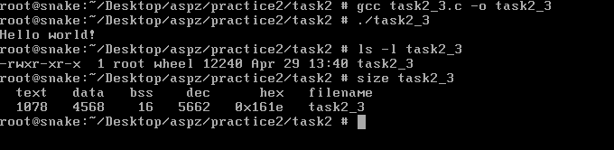
### [Код завдання](task2/task2_3.c)


### Пояснення програми:

Локальні масиви завжди розміщуються в стеку під час виконання, незалежно від того, ініціалізовані вони чи ні. Непочатковий arr1 просто резервує місце в стековому кадрі. Для arr2 компілятор згенерує інструкції, які при запуску заповнять перший елемент значенням 1, а решту обнулать, але самі дані не «лежать» у сегменті .data. Через це розмір бінарника змінюється не через новий сегмент, а лишень трохи зростає код ініціалізації в текстовому сегменті

### Результат роботи:

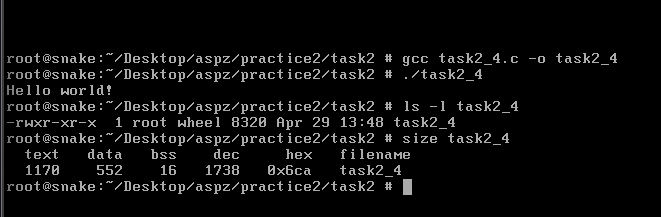
### [Код завдання](task2/task2_4.c)


### Пояснення програми:

При компіляції з опцією налагодження (`-g`) до бінарника додається велика кількість символів і структур для дебагу, тому розмір файлу суттєво зростає, хоча сегменти `.text`, `.data` та `.bss` залишаються тих самих розмірів. З іншого боку, увімкнення максимальної оптимізації (`-O3`) дозволяє компілятору вичавити зайві інструкції та скоротити текстовий сегмент, але обсяги сегментів даних і BSS не змінюються. Локальні масиви, незалежно від ініціалізації, розгортаються в стеку під час виконання й не впливають на розміри виконуваного файлу.

### Результат роботи:

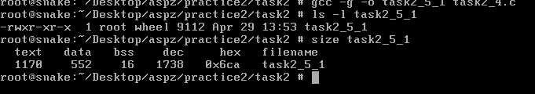

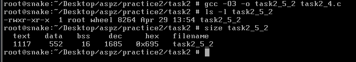
### [Код завдання](task2/task2_4.c)


## ЗАВДАННЯ 3:

### Умова:

Скомпілюйте й запустіть тестову програму, щоб визначити приблизне розташування стека у вашій системі:
```c
#include <stdio.h>

int main() {
        int i;
        printf(&quot;The stack top is near %p\n&quot;, &amp;i);
        return 0;
}
```
Знайдіть розташування сегментів даних і тексту, а також купи всередині сегмента даних, оголосіть змінні, які будуть поміщені в ці сегменти, і виведіть їхні адреси. Збільшіть розмір стека, викликавши функцію й оголосивши кілька великих локальних масивів. Яка зараз адреса вершини стека?

*Примітка*: стек може розташовуватися за різними адресами на різних архітектурах та різних ОС. Хоча ми говоримо про вершину стека, на більшості процесорів стек зростає вниз, до пам’яті з меншими значеннями адрес.


### Результати:

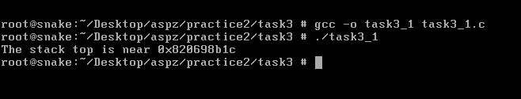
### [Код завдання](task3/task3_1.c)


### Пояснення програми:

Код досліджує розташування різних сегментів пам’яті. Адреса функції `func` показує текстовий сегмент (зберігає машинний код програми). Глобальна змінна `x` з ініціалізацією належить до сегмента DATA, а неініціалізована глобальна змінна `y` — до сегмента BSS. Виділення пам’яті через `malloc` демонструє розташування купи, а адреса локальної змінної `z` показує місце стека. Програма допомагає зрозуміти, як пам’ять організована і використовується різними сегментами.

### Результати:

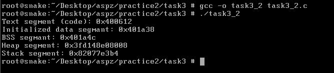
### [Код завдання](task3/task3_2.c)


### Пояснення програми:

У коді досліджується, як змінюється розташування вершини стека при виділенні великих локальних масивів. На початку виводиться адреса змінної `i` у `main`, що вказує на початкове розташування стека. Після виклику функції func, де оголошені масиви `arr1` і `arr2`, адреса вершини стека зсувається вниз (у більшість архітектур стек зростає до нижчих адрес). Це ілюструє динамічний характер використання стека під час виконання програми.

### Результати:

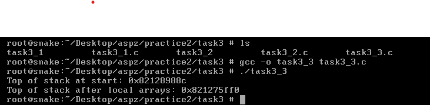
### [Код завдання](task3/task3_3.c)


## ЗАВДАННЯ 4:

### Умова:

Ваше завдання – дослідити стек процесу або пригадати, як це робиться. Ви
можете:
● Автоматично за допомогою утиліти gstack.
● Вручну за допомогою налагоджувача GDB.


## Пояснення програми:

Ця програма ілюструє глибину вкладення викликів: з main вона переходить у foo, потім у bar і нарешті в bar_is_now_closed, причому кожна функція виводить адресу своєї локальної змінної через макрос MSG. Після виклику bar_is_now_closed виконання зупиняється на pause, очікуючи сигналу. Для дослідження стеку процесу можна використати procstat, який негайно видає знімок кадрів стека всіх потоків без взаємодії з користувачем. Натомість GDB забезпечує інтерактивний доступ: він дозволяє переглядати стек, значення змінних, перемикатися між кадрами й виконувати покроковий аналіз коду. Procstat простий і швидкий, а GDB – інструмент для глибокого налагодження, що потребує більше знань. Procstat дає миттєвий знімок стеку, а GDB дозволяє дослідити змінні й стек докладно.
### Результати:

Запуск програми:

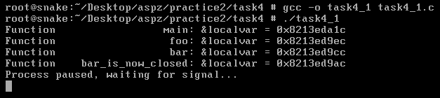

Procstat:

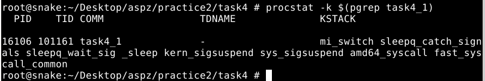

GDB:

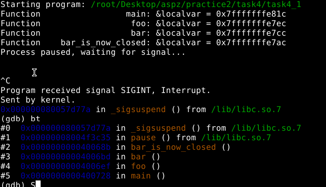
### [Код завдання](task4/task4.c)

## ЗАВДАННЯ 5:

### Умова:

Відомо, що при виклику процедур і поверненні з них процесор використовує стек.Чи можна в такій схемі обійтися без лічильника команд (IP), використовуючи замість нього вершину стека? Обґрунтуйте свою відповідь та наведіть приклади.


### Результати:

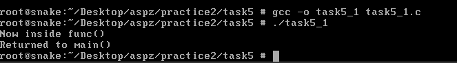
### [Код завдання](task5/task5_1.c)


### Пояснення програми:

У класичній архітектурі процесор завжди покладається на лічильник команд (IP) для визначення наступної інструкції, а стек використовується лише як сховище адрес повернення та локальних даних. При виклику функції адреса наступної інструкції зберігається в стеку, але саме IP оновлюється з цієї адреси під час повернення, забезпечуючи правильний порядок виконання. Якщо спробувати замінити IP «вершиною» стека за допомогою ручних операцій над регістром RSP (наприклад, через asm("addq $8, %rsp")), процесор не отримає коректного значення IP і може переключитися на довільну або некоректну адресу, що призведе до аварійного завершення програми. Таким чином обійтися без IP неможливо без суттєвих змін в самій архітектурі: стек не може виконувати роль покажчика на поточну інструкцію, оскільки він не гарантує послідовності та цілісності коду.

### Результати:

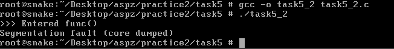
### [Код завдання](task5/task5_2.c)

## ЗАВДАННЯ ПО ВАРІАНТАХ (14 ВАРІАНТ):

### Умова:

14. Реалізуйте програму для аналізу вмісту /proc/self/maps.


### Пояснення програми:
Ця програма отримує власний PID через getpid() і виводить його, після чого за допомогою snprintf формується команда procstat -v <pid>. Виклик system() запускає цю утиліту, яка повертає детальний знімок віртуальних відображень пам’яті процесу. Якщо procstat завершується з помилкою, програма повідомляє про це й повертає код 1. Вивід procstat -v містить інформацію про базову та динамічну пам’ять, включно зі стеком, heap, статичною секцією й підключеними бібліотеками, що допомагає розуміти розподіл адрес і права доступу в кожному регіоні. Такий підхід дає змогу швидко оглянути вміст сегментів виконуваного файлу без написання власного парсера. У продакшн‑середовищі замість system() можна використовувати fork/exec для кращого контролю помилок і безпеки.

### Результати:

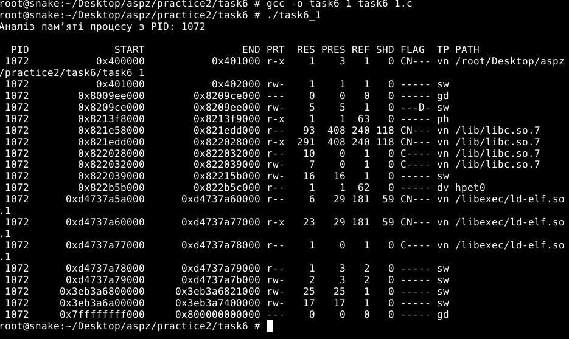
### [Код завдання](task6/task6_1.c)
