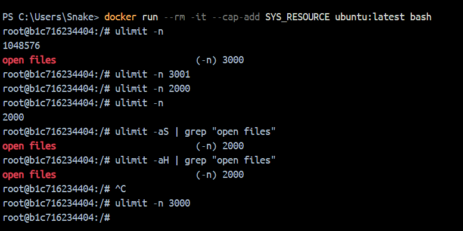

## ЗАВДАННЯ 1:

### Умова:

Запустіть Docker-контейнер і поекспериментуйте з максимальним лімітом ресурсів відкритих файлів. Для цього виконайте команди у вказаному порядку:

$ ulimit -n

$ ulimit -aS | grep "open files"

$ ulimit -aH | grep "open files"

$ ulimit -n 3000

$ ulimit -aS | grep "open files"

$ ulimit -aH | grep "open files"

$ ulimit -n 3001

$ ulimit -n 2000

$ ulimit -n

$ ulimit -aS | grep "open files"

$ ulimit -aH | grep "open files"

$ ulimit -n 3000

### Пояснення та опис програми:

Для виконання цієї задачі я використав докер на віндовс 

### Результати:

