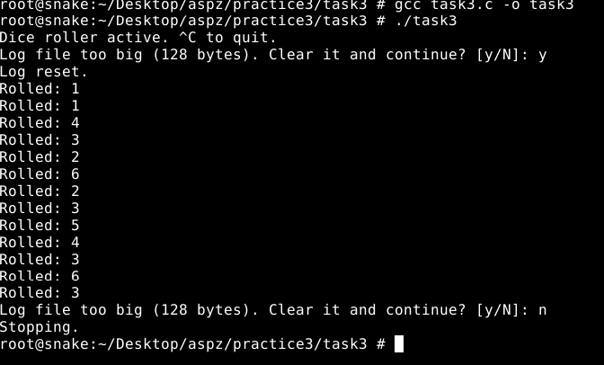

## ЗАВДАННЯ 1:

### Умова:

Запустіть Docker-контейнер і поекспериментуйте з максимальним лімітом ресурсів відкритих файлів. Для цього виконайте команди у вказаному порядку:

$ ulimit -n

$ ulimit -aS | grep "open files"

$ ulimit -aH | grep "open files"

$ ulimit -n 3000

$ ulimit -aS | grep "open files"

$ ulimit -aH | grep "open files"

$ ulimit -n 3001

$ ulimit -n 2000

$ ulimit -n

$ ulimit -aS | grep "open files"

$ ulimit -aH | grep "open files"

$ ulimit -n 3000

### Пояснення та опис програми:

Для цього завдання я запустив Docker‑контейнер на Ubuntu‑сервері, бо на FreeBSD Docker недоступний. Спочатку через grep я перевірив значення open files перед змінами, потім спостерігав, як змінюються soft (-aS) і hard (-aH) ліміти. За допомогою ulimit я перевірив поточний ліміт відкритих файлів, переглянув через ulimit -n і впевнився в зміні. Далі встановив 3000, спробував 3001, зменшив до 2000 і повернув 3000.Цю послідовність я робив одразу root‑привілегіями. На скрині видно результати команд.

### Результати:

## ЗАВДАННЯ 3:

### Умова:

Напишіть програму, що імітує кидання шестигранного кубика. Імітуйте кидки, результати записуйте у файл, для якого попередньо встановлено обмеження на його максимальний розмір (max file size). Коректно обробіть ситуацію перевищення ліміту.

### Пояснення та опис програми:

Ця програма імітує нескінченне кидання шестигранного кубика та зберігає результати у файл dice_log.txt, розмір якого обмежено 128 байт константою MAX_LOG_BYTES. Спочатку ініціалізується генератор випадкових чисел через srand(time(NULL)), після чого відкривається лог-файл у режимі додавання. У кожному циклі перед записом перевіряється поточний розмір файлу за допомогою stat: якщо він перевищив ліміт, користувач отримує запит на очищення логу або завершення роботи. На скрині видно, що після декількох кидків програма випала на перевищення ліміту, запропонувала «Clear it and continue? [y/N]», отримала «y» і відобразила «Log reset.», після чого записи відновилися. Коли файл знову перетнув межу, під час другого запиту користувач обрав «n» і програма завершила роботу з повідомленням «Stopping.». Усі операції запису супроводжуються fflush, а між кидками встановлено паузу через usleep(100000), що дозволяє відстежувати кожен результат у реальному часі. Така реалізація гарантує контроль за зростанням журналу та дає користувачеві можливість керувати його вмістом.
### Результати:

## [Код завдання](task3/task3.c)## 

## ЗАВДАННЯ 4:

### Умова:

Напишіть програму, що імітує кидання шестигранного кубика. Імітуйте кидки, результати записуйте у файл, для якого попередньо встановлено обмеження на його максимальний розмір (max file size). Коректно обробіть ситуацію перевищення ліміту.

### Пояснення та опис програми:

Ця програма симулює лотерею, вибираючи спочатку сім унікальних чисел від 1 до 49, а потім шість від 1 до 36, і виводить їх на екран. У самому початку встановлюється жорстке обмеження на час ЦП — дві секунди — за допомогою setrlimit(RLIMIT_CPU) та обробника сигналу SIGXCPU, який у разі перевищення ліміту негайно виведе “CPU time limit exceeded, exiting.” і завершить роботу. Після ініціалізації генератора випадкових чисел виконується перемішування масивів чисел за алгоритмом Фішера–Йетса (shuffle), а потім перші сім і шість елементів цих масивів виводяться через print_selection. На скриншоті видно результат запуску: “Lottery numbers (7 of 49): 9 39 24 23 14 5 21” і “Lottery numbers (6 of 36): 1 12 25 20 8 23”, після чого з’являється повідомлення “Generation complete.”. Оскільки обсяг обчислень невеликий, ліміт CPU не спрацьовує, але механізм обмеження забезпечує захист від випадкового зависання або надмірного навантаження процесора.

### Результати:

## [Код завдання](task4/task4.c)## 
