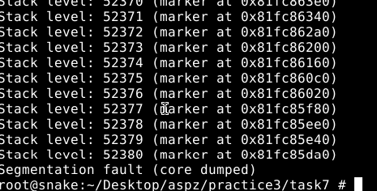

## ЗАВДАННЯ 1:

### Умова:

Запустіть Docker-контейнер і поекспериментуйте з максимальним лімітом ресурсів відкритих файлів. Для цього виконайте команди у вказаному порядку:

$ ulimit -n

$ ulimit -aS | grep "open files"

$ ulimit -aH | grep "open files"

$ ulimit -n 3000

$ ulimit -aS | grep "open files"

$ ulimit -aH | grep "open files"

$ ulimit -n 3001

$ ulimit -n 2000

$ ulimit -n

$ ulimit -aS | grep "open files"

$ ulimit -aH | grep "open files"

$ ulimit -n 3000

### Пояснення та опис програми:

Для цього завдання я запустив Docker‑контейнер на Ubuntu‑сервері, бо на FreeBSD Docker недоступний. Спочатку через grep я перевірив значення open files перед змінами, потім спостерігав, як змінюються soft (-aS) і hard (-aH) ліміти. За допомогою ulimit я перевірив поточний ліміт відкритих файлів, переглянув через ulimit -n і впевнився в зміні. Далі встановив 3000, спробував 3001, зменшив до 2000 і повернув 3000.Цю послідовність я робив одразу root‑привілегіями. На скрині видно результати команд.

### Результати:

## ЗАВДАННЯ 3:

### Умова:

Напишіть програму, що імітує кидання шестигранного кубика. Імітуйте кидки, результати записуйте у файл, для якого попередньо встановлено обмеження на його максимальний розмір (max file size). Коректно обробіть ситуацію перевищення ліміту.

### Пояснення та опис програми:

Ця програма імітує нескінченне кидання шестигранного кубика та зберігає результати у файл dice_log.txt, розмір якого обмежено 128 байт константою MAX_LOG_BYTES. Спочатку ініціалізується генератор випадкових чисел через srand(time(NULL)), після чого відкривається лог-файл у режимі додавання. У кожному циклі перед записом перевіряється поточний розмір файлу за допомогою stat: якщо він перевищив ліміт, користувач отримує запит на очищення логу або завершення роботи. На скрині видно, що після декількох кидків програма випала на перевищення ліміту, запропонувала «Clear it and continue? [y/N]», отримала «y» і відобразила «Log reset.», після чого записи відновилися. Коли файл знову перетнув межу, під час другого запиту користувач обрав «n» і програма завершила роботу з повідомленням «Stopping.». Усі операції запису супроводжуються fflush, а між кидками встановлено паузу через usleep(100000), що дозволяє відстежувати кожен результат у реальному часі. Така реалізація гарантує контроль за зростанням журналу та дає користувачеві можливість керувати його вмістом.
### Результати:

## [Код завдання](task3/task3.c)## 

## ЗАВДАННЯ 4:

### Умова:

Напишіть програму, що імітує кидання шестигранного кубика. Імітуйте кидки, результати записуйте у файл, для якого попередньо встановлено обмеження на його максимальний розмір (max file size). Коректно обробіть ситуацію перевищення ліміту.

### Пояснення та опис програми:

Ця програма симулює лотерею, вибираючи спочатку сім унікальних чисел від 1 до 49, а потім шість від 1 до 36, і виводить їх на екран. У самому початку встановлюється жорстке обмеження на час ЦП — дві секунди — за допомогою setrlimit(RLIMIT_CPU) та обробника сигналу SIGXCPU, який у разі перевищення ліміту негайно виведе “CPU time limit exceeded, exiting.” і завершить роботу. Після ініціалізації генератора випадкових чисел виконується перемішування масивів чисел за алгоритмом Фішера–Йетса (shuffle), а потім перші сім і шість елементів цих масивів виводяться через print_selection. На скриншоті видно результат запуску: “Lottery numbers (7 of 49): 9 39 24 23 14 5 21” і “Lottery numbers (6 of 36): 1 12 25 20 8 23”, після чого з’являється повідомлення “Generation complete.”. Оскільки обсяг обчислень невеликий, ліміт CPU не спрацьовує, але механізм обмеження забезпечує захист від випадкового зависання або надмірного навантаження процесора.

### Результати:

## [Код завдання](task4/task4.c)

## ЗАВДАННЯ 5:

### Умова:
Напишіть програму для копіювання одного іменованого файлу в інший. Імена файлів передаються у вигляді аргументів. Програма має:

    перевіряти, чи передано два аргументи, інакше виводити "Program need two arguments";

    перевіряти доступність першого файлу для читання, інакше виводити "Cannot open file .... for reading";

    перевіряти доступність другого файлу для запису, інакше виводити "Cannot open file .... for writing";

    обробляти ситуацію перевищення обмеження на розмір файлу.

### Пояснення та опис програми:

Ця програма реалізує копіювання вмісту одного файла в інший із низкою перевірок на коректність і безпеку. Спочатку вона переконується, що отримано дві різні імена файлів як аргументи, і в іншому випадку виводить "Program need two arguments" або"Error: source and destination must be different". Далі за допомогою stat перевіряється, що файли не посилаються на той самий індексний дескриптор, після чого відкривається файл-джерело в режимі читання та файл-призначення в режимі запису. Копіювання здійснюється блоками по 1024 байти, а накопичуваний обсяг записаних даниз контролюється проти ліміту в 1 МБ. Якщо під час запису розмір файлу перевищує обмеження, програма виводить відповідну помилку й завершується .

На скрині видно успішне копіювання текстового файла "text.txt" у "text_new.txt" з відображенням вмісту після операції, а також правильне спрацьовування перевірки на однакові імена, коли вихідні та цільові файли співпадають. Такий підхід гарантує коректне й безпечне дублювання файлів.

### Результати:

## [Код завдання](task5/task5.c)

## ЗАВДАННЯ 6:

### Умова:
Напишіть програму, що демонструє використання обмеження (max stack segment size). Підказка: рекурсивна програма активно використовує стек.

### Пояснення та опис програми:

У цьому завданні я перевірив, як обмеження розміру сегмента стека впливає на глибину рекурсії. Спочатку через ulimit -s я побачив дефолтний ліміт у 8192 КБ, потім встановив його в 256 КБ і знову перевірив. Далі я скомпілював програму, яка в функції probe_stack на кожному рівні рекурсії оголошує локальний масив на 128 байт і виводить номер рівня і адресу маркера на стеку. Після запуску «Stack probing started…» програма друкує “Stack level: 1 (marker at 0x…)”, “Stack level: 2 …” і так далі. На скрині видно, що при глибині близько 1589 викликів рекурсія досягає межі й отримує Segmentation fault (core dumped). Це демонструє, що при активному використанні стека навіть невеликі обсяги локальних змінних швидко витрачають пам’ять, і обмеження ulimit -s реально зупиняє програму, захищаючи систему від неконтрольованого росту стеку.

### Результати:

## [Код завдання](task6/task6.c)

## ЗАВДАННЯ 7:

### Умова:
Запустити контейнер з різними значеннями ulimit та порівняти поведінку програм.
### Пояснення та опис програми:

На скріншотах видно  як обмеження розміру стекового сегмента впливає на глибину рекурсії. Програма probe_stack на кожному рівні виклику створює локальний масив на 128 байт і виводить номер рівня та адресу цього маркера. При старті без змін у ulimit -s стек становив близько 8 МБ, і програма досягла понад 52 000 вкладених викликів, перш ніж уперлася в межу, що видно на першому скриншоті з помилкою Segmentation fault. Коли ж перед запуском стек обмежили до 256 КБ, та сама реалізація завершилася аварією вже на 1 587 рівні, про що свідчить другий скріншот. Це чітко демонструє, що ліміт max stack segment size реально обмежує число рекурсивних викликів і споживання пам’яті в стеку.

### Результати:

## [Код завдання](task6/task6.c)
