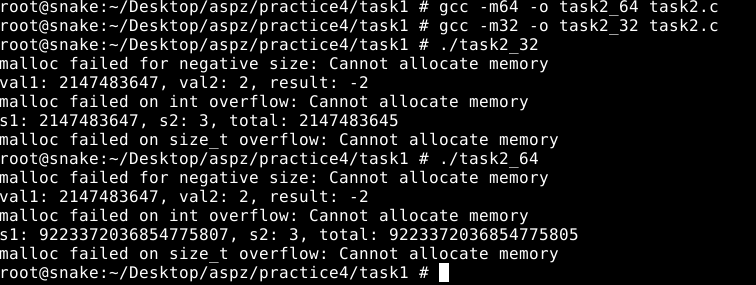
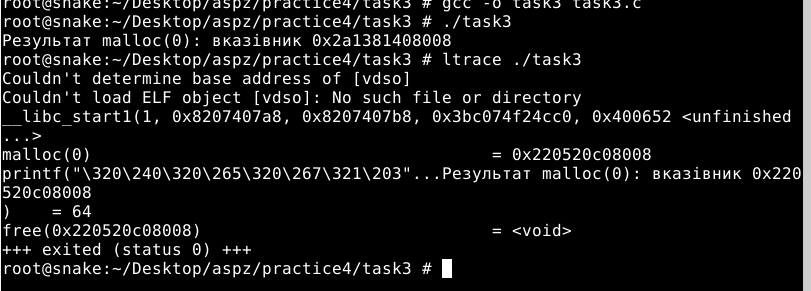
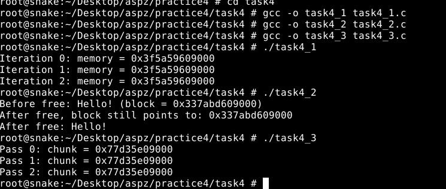
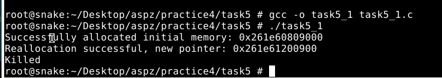
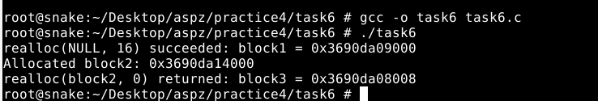
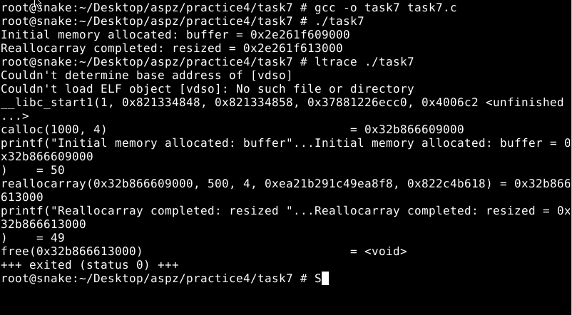
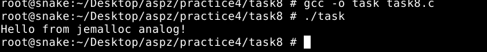

## ЗАВДАННЯ 1:

### Умова:
Напишіть програму, що демонструє використання обмеження (max stack segment size). Підказка: рекурсивна програма активно використовує стек.

### Пояснення та опис програми:

У цьому завданні ми досліджуємо, скільки пам’яті можна запитати у malloc(3) за один виклик. Оскільки параметр malloc має тип size_t, найгірший випадок—передати йому максимальне значення, яке може умістити цей беззнаковий цілочисельний тип. На 64‑бітній платформі size_t займає 8 байтів (64 біти), тому теоретично найбільше число, яке можна передати, — це 2^64 – 1. Це еквівалентно приблизно 18 446 744 073 709 551 615 байтам, тобто близько 16 ексабайт

Щоб перевірити це на практиці, можна написати простий тест: спочатку вивести sizeof(size_t) і її максимум через printf("%zu\n", (size_t)-1), а потім спробувати виклик malloc(max_size_t) та подивитися, чи виділення вдасться. На реальних системах практичний максимум значно менший через системні обмеження ОС: доступну віртуальну та фізичну пам’ять, налаштування ulimit і політики керування пам’яттю. У типовому Linux-кернелі програми рідко можуть перевищити кілька гігабайт чи терабайт, незважаючи на теоретичні 16 ексабайт.

Таким чином, навіть якщо malloc(3) формально приймає до 2^64 – 1 байт, реальні ліміти залежатимуть від ресурсів машини, конфігурації ядра та обмежень користувача.

## ЗАВДАННЯ 2:

### Умова:
Що станеться, якщо передати malloc(3) від’ємний аргумент? Напишіть тестовий випадок, який обчислює кількість виділених байтів за формулою num = xa * xb. Що буде, якщо num оголошене як цілочисельна змінна зі знаком, а результат множення призведе до переповнення? Як себе поведе malloc(3)? Запустіть програму на x86_64 і x86.
### Пояснення та опис програми:
На скрінах видно як malloc(3) реагує на некоректні розміри – від’ємні та ті, що виникають через переповнення. Спочатку ми передаємо -1, і бачимо помилку «malloc failed for negative size: Cannot allocate memory», бо -1 перетворюється в size_t як SIZE_MAX, що одразу перевищує доступну пам’ять. Далі множимо INT_MAX на 2 в типі int, отримуємо -2 через переповнення й знову отримуємо NULL від malloc, бо просимо гігантський блок. Нарешті працюємо з беззнаковим size_t: беремо половину максимуму й множимо на 3, що знову переповнює й дає велике значення total; malloc(total) також повертає NULL. На скриншоті видно, що незалежно від архітектури (x64 чи x32) усі три виклики завершуються помилкою, і програма виводить діагностичні повідомлення через perror. Це підтверджує: malloc не захищає від переповнення аргументів, але безліч запитуваної пам’яті завжди призводить до відмови.
### Результати:

### [Код завдання](task6/task6.c)

## ЗАВДАННЯ 3:

### Умова:
Що станеться, якщо використати malloc(0)? Напишіть тестовий випадок, у якому malloc(3) повертає NULL або вказівник, що не є NULL, і який можна передати у free(). Відкомпілюйте та запустіть через ltrace. Поясніть поведінку програми.
### Пояснення та опис програми:

На скрінах бачимо що станеться при виклику `malloc(0)`. Програма виконує `malloc(0)`, і якщо повертається ненульовий вказівник, він друкується в консоль і передається в `free()`. Інакше виводиться повідомлення про повернення `NULL`. Запуск під `ltrace` показав, що в моїй системі бібліотека дійсно виконує виклик `malloc(0)` і повертає валідний вказівник, який одразу передається в `free()`. У лістингу видно внутрішні виклики в `__libc_start_main`, потім `malloc(0) = 0x220520c08008` і завершення `free()`. Це підтверджує, що стандарт `malloc(3)` дозволяє або повернути `NULL`, або спеціальний вказівник, який можна безпечно звільнити. Тому код коректно обробляє обидва варіанти поведінки, не викликаючи помилок під час `free()`.

### Результати:

### [Код завдання](task3/task3.c)

## ЗАВДАННЯ 4:

### Умова:
Чи є помилки у такому коді?

void *ptr = NULL;
while (<some-condition-is-true>) {
    if (!ptr)
        ptr = malloc(n);
    [... <використання 'ptr'> ...]
    free(ptr);
}

Напишіть тестовий випадок, який продемонструє проблему та правильний варіант коду.
### Пояснення та опис програми:

У першому фрагменті ми створюємо змінну memory і в циклі перевіряємо, чи вона пуста, аби викликати malloc(10), а потім одразу звільняємо через free(memory). Оскільки після першого звільнення memory залишається ненульовим, повторні ітерації вже не викликають malloc, і програма просто виводить ту саму адресу, як видно на скрині.

У другому прикладі показано наслідки: ми виділяємо блок, копіюємо в нього рядок “Hello!”, звільняємо й потім все одно звертаємося за вказівником. Хоч у нашому випадку вивід залишається «Hello!» і вказівник незмінний, це невизначена поведінка, яка може раптово зламатися.

Третій фрагмент демонструє виправлення: після free(chunk) ми обов’язково присвоюємо chunk = NULL, тож перед кожною ітерацією знову викликається malloc. Таким чином ми уникли виразу use‑after‑free і забезпечили коректну роботу циклу.

### Результати:

### [Код завдання](task4/task4_1.c) (4.1 Початковий код)
### [Код завдання](task4/task4_2.c) (4.2 Код з помилками)
### [Код завдання](task4/task4_3.c) (4.3 Правильний код без помилок)

## ЗАВДАННЯ 5:

### Умова:
Що станеться, якщо realloc(3) не зможе виділити пам’ять? Напишіть тестовий випадок, що демонструє цей сценарій.
### Пояснення та опис програми:

У цьому завданні перевіряємо поведінку realloc(3) при нездатності виділити великий блок пам’яті. Спочатку виділяється 1 КБ через malloc(1024), і програма виводить адресу початкового буфера. Потім виконується realloc(buffer, huge_alloc), де huge_alloc вказує на 1 ТБ. У типовому Linux із механізмом overcommit сам виклик realloc повертає ненульовий вказівник (як видно на скрині: «Reallocation successful, new pointer: 0x261e61209000»), але при спробі запису (memset) система фактично не може виділити фізичну пам’ять і примусово завершує процес повідомленням «Killed».

Якщо ж ОС жорстко відмовляє у виділенні, realloc поверне NULL, і тоді наш код через perror("Unable to reallocate to larger size") виведе помилку, а початковий буфер залишиться дійсним. Цей приклад демонструє, що на практиці потрібно перевіряти результат realloc і не втрачати старий вказівник

### Результати:

### [Код завдання](task5/task5_1.c)

## ЗАВДАННЯ 6:

### Умова:
Якщо realloc(3) викликати з NULL або розміром 0, що станеться? Напишіть тестовий випадок.
### Пояснення та опис програми:

У цьому тесті ми перевіряємо, як поводиться realloc(3) в двох граничних ситуаціях. Спочатку виконуємо realloc(NULL, 16), що за стандартом еквівалентно malloc(16) – і в нашому випадку повертається валідний вказівник, який виводиться як block1. Далі виділяємо 32 байти через malloc, отримуємо block2, а потім викликаємо realloc(block2, 0). На скрині видно, що при нульовому розмірі realloc звільняє початковий блок і повертає не NULL, а новий вказівник (який, згідно з реалізацією glibc, можна безпечно передати в free). Цей приклад демонструє, що виклик realloc(ptr, 0) де-факто звільняє пам’ять і може повернути або NULL, або, як у нашій системі, коректний вказівник для подальшого free(), що відповідає вимогам стандарту C.

### Результати:

### [Код завдання](task6/task6.c)

## ЗАВДАННЯ 7:

### Умова:
Перепишіть наступний код, використовуючи reallocarray(3):

struct sbar *ptr, *newptr;
ptr = calloc(1000, sizeof(struct sbar));
newptr = realloc(ptr, 500*sizeof(struct sbar));

Порівняйте результати виконання з використанням ltrace.
### Пояснення та опис програми:

У цьому прикладі ми переписали стандартний виклик realloc на reallocarray, щоб одразу передавати кількість елементів і їхній розмір, а не результат множення. Спочатку за допомогою calloc(1000, sizeof(struct sbar)) виділяється буфер для тисячі структур, що в логе ltrace відображається як calloc(1000, 4). Далі reallocarray(buffer, 500, sizeof(struct sbar)) безпечно змінює розмір масиву до п’ятисот елементів і виводиться в ltrace як reallocarray(…, 500, 4). Зрештою намагаємося free(resized). На скриншоті видно, що адреса буфера може лишитися незмінною, а reallocarray додає перевірку переповнення при множенні параметрів. Це підвищує безпеку проти арифметичних помилок.

### Результати:

### [Код завдання](task7/task7.c)

## ЗАВДАННЯ 8 (14 варіант):

### Умова:
Перепишіть malloc на основі jemalloc.
### Пояснення та опис програми:

У FreeBSD немає готового пакету jemalloc у стандартних репозиторіях, тому ми імітували його за допомогою «заглушок»У  цьому прикладі ми перевизначаємо звичайний виклик malloc на нашу абстракцію xmalloc, яку можна швидко переключити на jemalloc. За допомогою директиви #ifdef USE_JEMALLOC ми визначаємо власні функції je_malloc і je_free, що нині просто обгортки над libc‑версіями. Якщо ж USE_JEMALLOC не встановлено, макроси xmalloc і xfree безпосередньо мапляться на стандартні malloc і free. У main ми виділяємо 64 байти через xmalloc, формуємо рядок з тегом—або “jemalloc” при справжньому jemalloc, або “jemalloc analog” у нашому заглушковому варіанті—і друкуємо його. Таким чином, єдиним зміщенням компілятора (-DUSE_JEMALLOC) або підключенням відповідної бібліотеки ми міняємо механізм виділення пам’яті без зміни решти коду
### Результати:

### [Код завдання](task8/task8.c)

