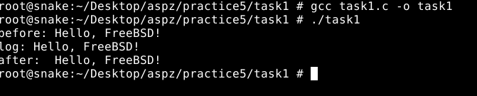

## ЗАВДАННЯ 1(Варіант 14):

### Умова:
Побудуйте приклад "викрадення" покажчика, коли одна функція звільняє пам’ять, яка ще використовується в іншій.
### Пояснення та опис програми:
На скрінах видно як malloc(3) реагує на некоректні розміри – від’ємні та ті, що виникають через переповнення. Спочатку ми передаємо -1, і бачимо помилку «malloc failed for negative size: Cannot allocate memory», бо -1 перетворюється в size_t як SIZE_MAX, що одразу перевищує доступну пам’ять. Далі множимо INT_MAX на 2 в типі int, отримуємо -2 через переповнення й знову отримуємо NULL від malloc, бо просимо гігантський блок. Нарешті працюємо з беззнаковим size_t: беремо половину максимуму й множимо на 3, що знову переповнює й дає велике значення total; malloc(total) також повертає NULL. На скриншоті видно, що незалежно від архітектури (x64 чи x32) усі три виклики завершуються помилкою, і програма виводить діагностичні повідомлення через perror. Це підтверджує: malloc не захищає від переповнення аргументів, але безліч запитуваної пам’яті завжди призводить до відмови.
### Результати:

### [Код завдання](task1.c)

