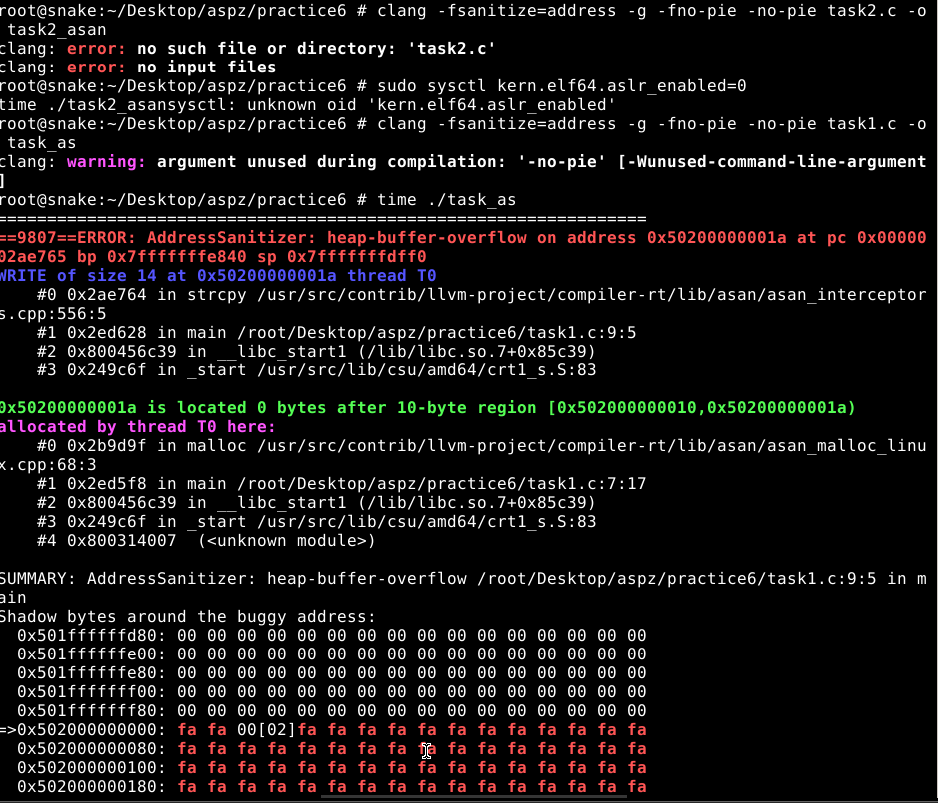
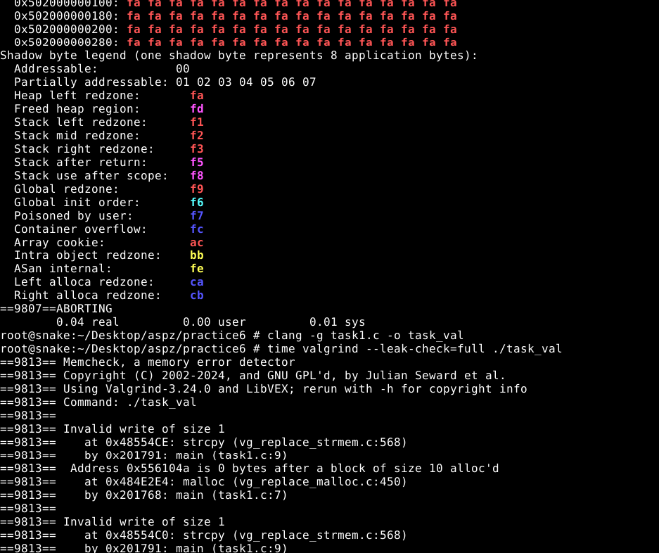

## ЗАВДАННЯ 1 (14 варіант):

### Умова:
Скомпілюйте програму з підтримкою ASan (-fsanitize=address -g) і порівняйте з Valgrind по швидкості та виходу.
### Пояснення та опис програми:
У цьому завданні ми навмисно викликаємо heap‑buffer‑overflow: програма виділяє лише 10 байт через malloc(10), а потім у межах цих 10 байт копіює 13‑символьний рядок "0123456789ABC" за допомогою strcpy. При компіляції з AddressSanitizer (-fsanitize=address -g) і запуску на скрині видно миттєвий вихідний звіт про помилку: ASan вказує, що запис розміром 14 байт виходить за межі виділеного буфера, показує трасу викликів і карту «shadow bytes», а потім припиняє виконання. Потім те саме ми проганяємо під Valgrind (--leak-check=full): він виявляє дві невірні операції запису через strcpy і повідомляє точну адресу буфера та виклики в трасі, але програма доки ся діє далі. ASan реагує майже миттєво з невеликим оверхедом, тоді як Valgrind працює значно повільніше, зате не потребує спеціальних прапорів компіляції. Обидва інструменти коректно ловлять переповнення, але ASan дає більш детальну та зручну інформацію в режимі реального часу.## ЗАВДАННЯ 1:
### Результати:

### [Код завдання](task1.c)

