## ЗАВДАННЯ 1:

### Умова:
 Використайте popen(), щоб передати вивід команди rwho (команда UNIX) до more (команда UNIX) у програмі на C.
### Пояснення та опис програми:

### Результати:

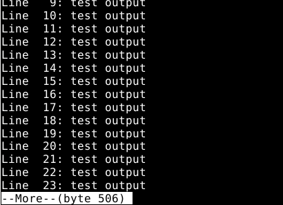
### [Код завдання](task1/task.c)

## ЗАВДАННЯ 2:

### Умова:
 Напишіть програму мовою C, яка імітує команду ls -l в UNIX — виводить список усіх файлів у поточному каталозі та перелічує права доступу тощо.
 (Варіант вирішення, що просто виконує ls -l із вашої програми, — не підходить.)
### Пояснення та опис програми:

### Результати:

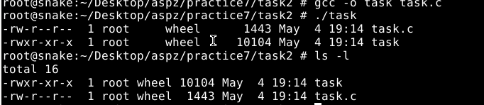
### [Код завдання](task2/task.c)

## ЗАВДАННЯ 3:

### Умова:
 Напишіть програму, яка друкує рядки з файлу, що містять слово, передане як аргумент програми (проста версія утиліти grep в UNIX).
### Пояснення та опис програми:

### Результати:

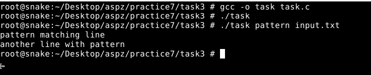
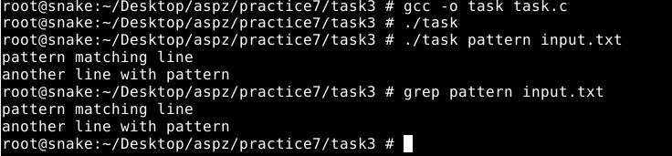
### [Код завдання](task3/task.c)

## ЗАВДАННЯ 4:

### Умова:
 Напишіть програму, яка виводить список файлів, заданих у вигляді аргументів, з зупинкою кожні 20 рядків, доки не буде натиснута клавіша (спрощена версія утиліти more в UNIX).
### Пояснення та опис програми:

### Результати:

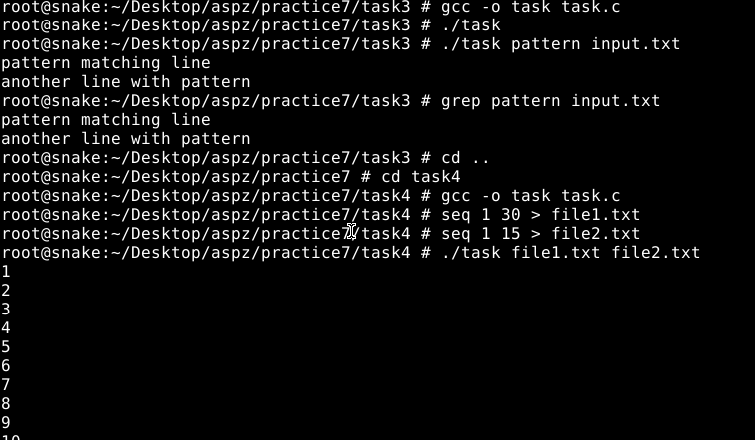
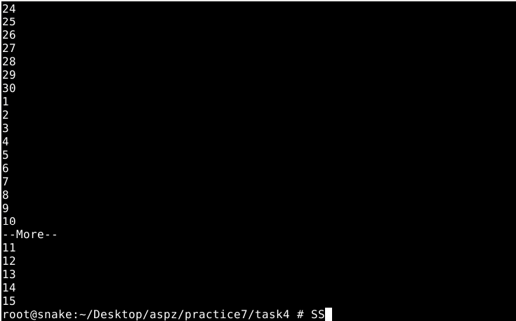
### [Код завдання](task4/task.c)

## ЗАВДАННЯ 5:

### Умова:
 Напишіть програму, яка перелічує всі файли в поточному каталозі та всі файли в підкаталогах.
### Пояснення та опис програми:

### Результати:

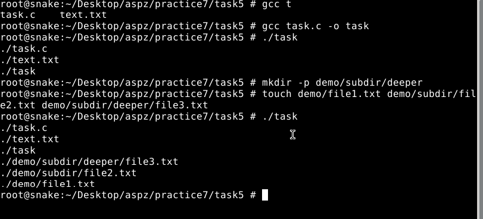
### [Код завдання](task5/task.c)

## ЗАВДАННЯ 6:

### Умова:
 Напишіть програму, яка перелічує лише підкаталоги у алфавітному порядку.
### Пояснення та опис програми:

### Результати:

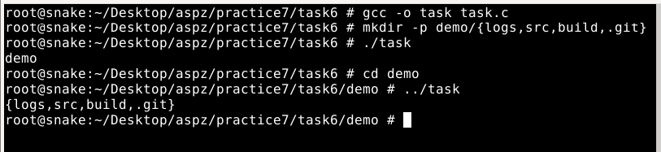
### [Код завдання](task6/task.c)

## ЗАВДАННЯ 7:

### Умова:
 Напишіть програму, яка показує користувачу всі його/її вихідні програми на C, а потім в інтерактивному режимі запитує, чи потрібно надати іншим дозвіл на читання (read permission); у разі ствердної відповіді — такий дозвіл повинен бути наданий.
### Пояснення та опис програми:

### Результати:

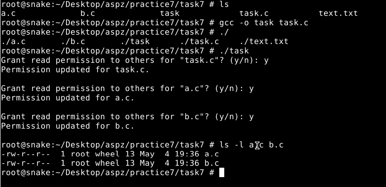
### [Код завдання](task7/task.c)

## ЗАВДАННЯ 8:

### Умова:
 Напишіть програму, яка надає користувачу можливість видалити будь-який або всі файли у поточному робочому каталозі. Має з’являтися ім’я файлу з запитом, чи слід його видалити.
### Пояснення та опис програми:

### Результати:

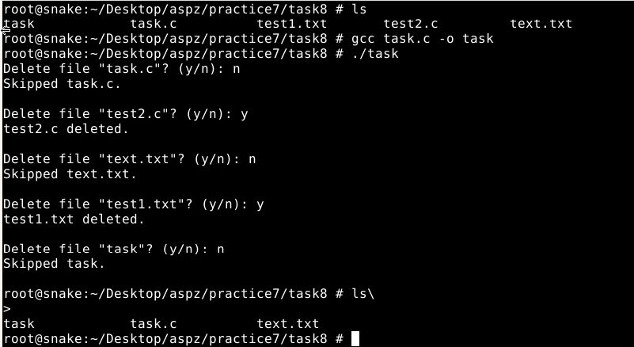
### [Код завдання](task8/task.c)

## ЗАВДАННЯ 9:

### Умова:
 Напишіть програму на C, яка вимірює час виконання фрагмента коду в мілісекундах.
### Пояснення та опис програми:

### Результати:

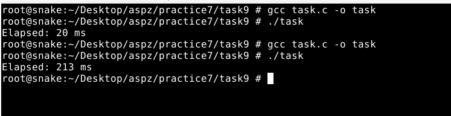
### [Код завдання](task9/task.c)

## ЗАВДАННЯ 10:

### Умова:
 Напишіть програму мовою C для створення послідовності випадкових чисел з плаваючою комою у діапазонах:
 (a) від 0.0 до 1.0
 (b) від 0.0 до n, де n — будь-яке дійсне число з плаваючою точкою.
 Початкове значення генератора випадкових чисел має бути встановлене так, щоб гарантувати унікальну послідовність.
Примітка: використання прапорця -Wall під час компіляції є обов’язковим.

### Пояснення та опис програми:

### Результати:

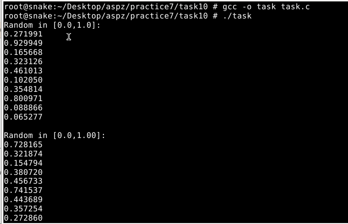
### [Код завдання](task10/task.c)

## ЗАВДАННЯ 11 (Варіант 14):
Реалізуйте засіб, який дозволяє відновити вилучений файл, якщо доступ до диску не було втрачено повністю.

### Умова:

### Пояснення та опис програми:

### Результати:

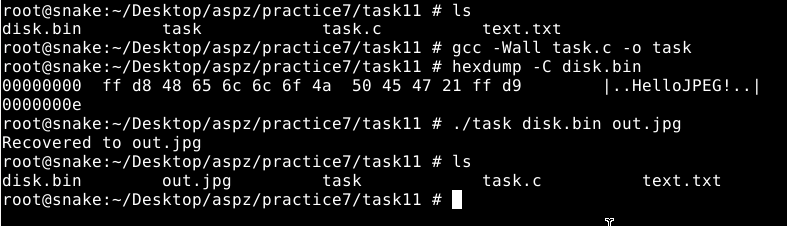
### [Код завдання](task11/task.c)

