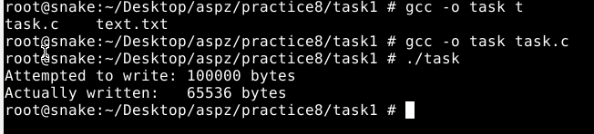
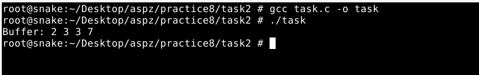
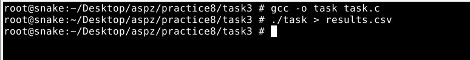
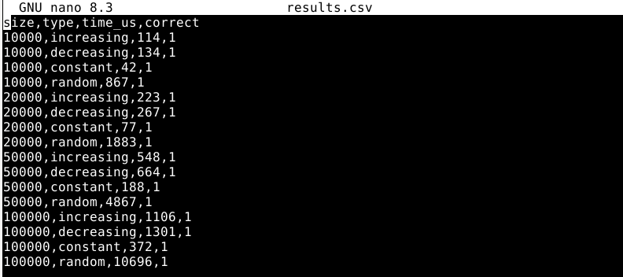
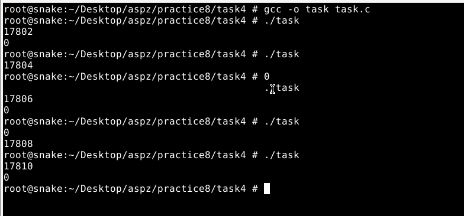
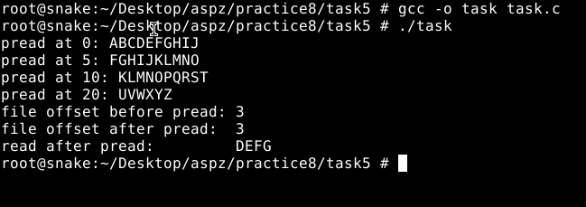

## ЗАВДАННЯ 1:

### Умова:
 Чи може виклик count = write(fd, buffer, nbytes); повернути в змінній count значення, відмінне від nbytes? Якщо так, то чому? Наведіть робочий приклад програми, яка демонструє вашу відповідь.
### Пояснення та опис програми:
Програма створює канал pipe, потім переводить його записний кінець у неблокуючий режим через fcntl з прапорцем O_NONBLOCK. Після цього виділяється буфер на 100 000 байт, заповнений літерами 'A', і викликається write(pipefd[1], buffer, 100000).

Коли виклик write доходить до ядра, воно бачить, що внутрішній кільцевий буфер pipe у FreeBSD має фіксований розмір 64 КіБ (65536 байт). Оскільки ми нічого з цього каналу не читаємо, вільне місце саме 65536 байт - от і отримуємо, що фактично записано лише цей обсяг. Завдяки O_NONBLOCK write не чекає, доки хтось звільнить додаткове місце, а миттєво повертає число записаних байт. Ось чому на екрані бачимо Attempted to write: 100000 bytes, Actually written: 65536 bytes, тобто частковий запис без помилки, просто скільки склалося в канал за один раз.
### Результати:

### [Код завдання](task1/task.c)

## ЗАВДАННЯ 2:

### Умова:
 Є файл, дескриптор якого - fd. Файл містить таку послідовність байтів: 4, 5, 2, 2, 3, 3, 7, 9, 1, 5. У програмі виконується наступна послідовність системних викликів:
lseek(fd, 3, SEEK_SET);
read(fd, &buffer, 4);
де виклик lseek переміщує покажчик на третій байт файлу. Що буде містити буфер після завершення виклику read? Наведіть робочий приклад програми, яка демонструє вашу відповідь.

### Пояснення та опис програми:
В цій прогрвмі ми створюємо і відкриваємо файл, записуєм в нього байти 4 5 2 2 3 3 7 9 1 5, після чого викликаємо
lseek(fd, 3, SEEK_SET) - це переводить курсор на четвертый байт і далі читаємо байти з цієї позиції, і в наш буфер попадає 2 3 3 7, тобто, lseek перескакує курсор у середину файлу, а read тягне звідти задану кількість байтів.
### Результати:

### [Код завдання](task2/task.c)

## ЗАВДАННЯ 3:

### Умова:
 Бібліотечна функція qsort призначена для сортування даних будь-якого типу. Для її роботи необхідно підготувати функцію порівняння, яка викликається з qsort кожного разу, коли потрібно порівняти два значення.
 Оскільки значення можуть мати будь-який тип, у функцію порівняння передаються два вказівники типу void* на елементи, що порівнюються.
Напишіть програму, яка досліджує, які вхідні дані є найгіршими для алгоритму швидкого сортування. Спробуйте знайти кілька масивів даних, які змушують qsort працювати якнайповільніше. Автоматизуйте процес експериментування так, щоб підбір і аналіз вхідних даних виконувалися самостійно.

Придумайте і реалізуйте набір тестів для перевірки правильності функції qsort.

### Пояснення та опис програми:
Наша програма підготувала чотири типи масивів різного розміру - зростаючий, спадний, константний і випадковий - і для кожного з них заміряла час виконання qsort, після чого вивела результати у форматі csv size, type, time_us, correct
У згенерованому CSV чітко видно, що при збільшенні розміру масиву сортування випадкових даних займає найбільше часу (наприклад, близько 10696 ms для 100 000 елементів), тоді як already sorted (increasing) i спадаючі (decreasing) набори впорядковуються значно швидше (приблизно 1106 ms і 1301 ms відповідно), а масив із однаковими значеннями (constant) обробляється найшвидше (372 ms на 100 000 елементів). Це показує, що найгірші вхідні дані для стандартного qsort - це великі випадкові масиви, тоді як вже відсортовані або однорідні масиви алгоритм проходить швидко.
### Результати:

### [Код завдання](task3/task.c)

## ЗАВДАННЯ 4:

### Умова:
Виконайте наступну програму на мові програмування С:
int main() {
  int pid;
  pid = fork();
  printf("%d\n", pid);
}
Завершіть цю програму. Припускаючи, що виклик fork() був успішним, яким може бути результат виконання цієї програми?

### Пояснення та опис програми:
Коли наша програма доходить до виклику fork(), вона подвоюється - з’являється батьківський і дочірній процес. У батьківському процесі fork() повертає число - це PID новоствореного дочірнього процесу  17802, 17804 тощо). А в дочці fork() повертає нуль. Обидва одночасно виконують printf("%d\n", pid);, тому на скріншотах бачимл дві стрічки: одна з ненульовим PID (це батько), інша з нулем (то дитина).
Порядок цих двох рядків може змінюватися від запуску до запуску - у одних випадках спочатку друкує батько, потім дитина, в інших навпаки.
### Результати:

### [Код завдання](task4/task.c)

## ЗАВДАННЯ 5 (Варіант №14):

### Умова:
Створіть програму, яка досліджує ефект різних позицій у файлі при читанні через pread().
### Пояснення та опис програми:
Запускаючи цю програму, спочатку ми відкриваємо або створюємо файл data.bin і записуємо в нього рядок "ABCDEFGHIJKLMNOPQRSTUVWXYZ". Довжина цього рядка - 26 символів, тобто в файлі у нас лежать послідовні байти з літерами від A до Z.
Далі у циклі ми викликаємо pread(fd, buf, 10, pos), де pos бере значення 0, 5, 10 та 20. При кожному виклику ми читаємо 10 байтів, починаючи саме з тієї позиції, яку передали в pread(), і миттєво виводимо отриманий фрагмент у консоль:  
 `pread at 0: ABCDEFGHIJ`  (тут читаємо перші 10 літер (від A до J), бо початкова позиція 0)  
 `pread at 5: FGHIJKLMNO`  (з позиції 5 (літера F) - до O включно)  
 `pread at 10: KLMNOPQRST` (з K (індекс 10) - до T)  
 `pread at 20: UVWXYZ` (з 20-го байта (U) і далі, оскільки до кінця файлу лишається всього 6 символів, читається саме UVWXYZ)  
Після цього ми перевіряємо, як pread() впливає на поточний файловий офсет. Спочатку руками ставимо цей офсет на позицію 3 через lseek(fd, 3, SEEK_SET), потім робимо pread(fd, buf, 4, 15) (тобто зчитуємо 4 байти з позиції 15), а потім ще раз читаємо 4 байти звичайним read(fd, buf, 4), тоді бачимо:  
`file offset before pread: 3`  
`file offset after pread:  3`  
`read after pread:         DEFG`  
Це означає, що і до, і після виклику pread() значення курсора в файлі залишилося рівно 3 - бо pread читає за вказаною позицією, але не змінює внутрішній лічильник офсетів. А от звичайний read після цього вже пішов з позиції 3 і зчитає D E F G (лише 4 байти, починаючи з четвертого символу).
Отже, pread() може читати з будь-якої довільної позиції незалежно від поточного офсету і pread() не змінює поточний файловий офсет тому наступні виклики read() або інші операції зі стандартним читанням почнуться саме там, де вони були до pread().
### Результати:

### [Код завдання](task5/task.c)
