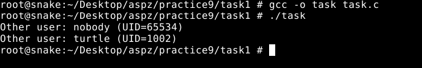
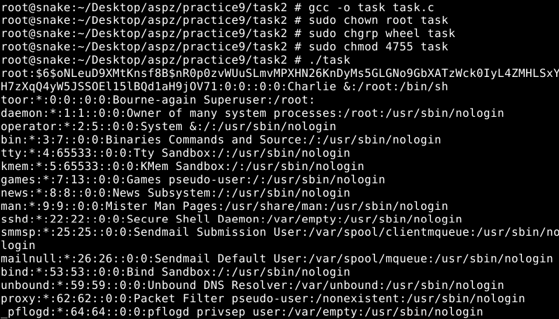
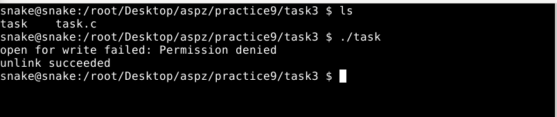
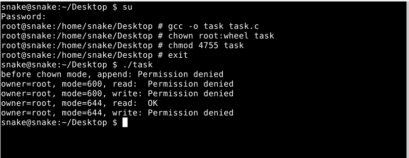
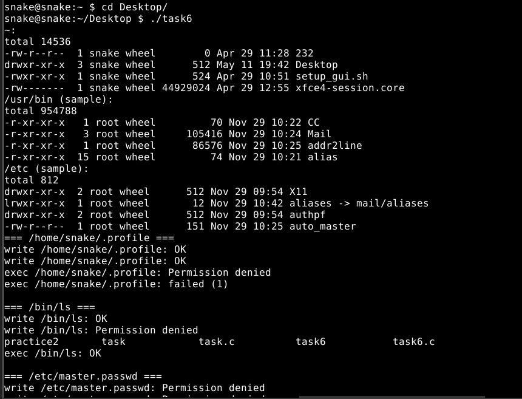
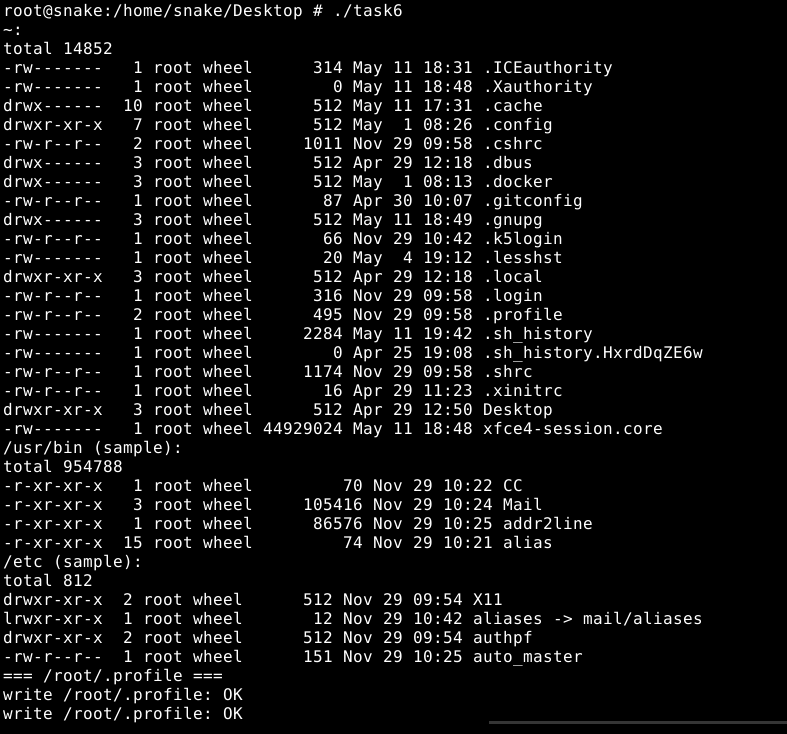
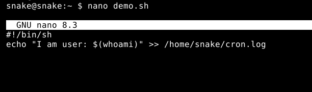
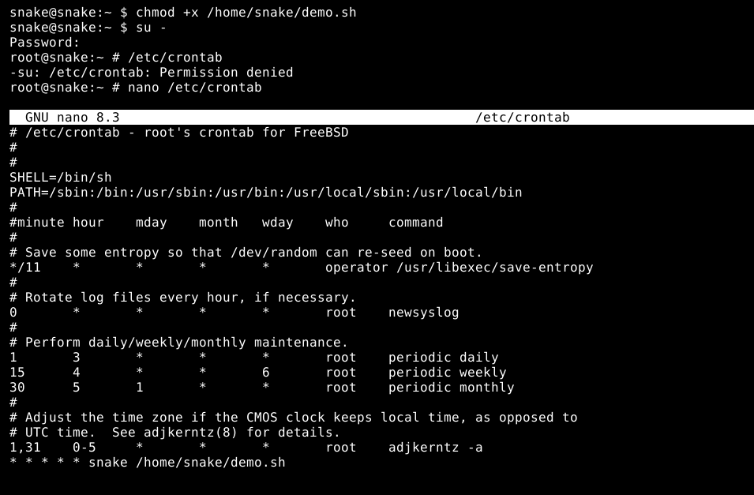
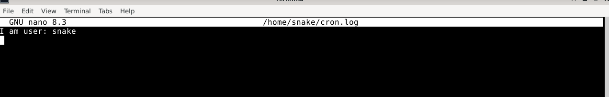

## ЗАВДАННЯ 1:
### Умова:
Напишіть програму, яка читає файл /etc/passwd за допомогою команди getent passwd, щоб дізнатись, які облікові записи визначені на вашому комп’ютері.
 Програма повинна визначити, чи є серед них звичайні користувачі (ідентифікатори UID повинні бути більші за 500 або 1000, залежно від вашого дистрибутива), окрім вас.

### Пояснення та опис програми:
Програма запускає команду getent passwd, підбирає всі рядки зі списком користувачів і далі пробігає по кожному, розбиваючи його на поля через strtok за двокрапкою. Після того, як вона витягла ім’я і UID, вона звіряє його зі своїм— getuid()— і з фіксованим порогом, що в нас взято 1000 (по дистрибутиву). Якщо UID більше за 1000 і не збігається з нашим, цей рядок вважається «іншим звичайним користувачем». От і виходить, що програма спочатку пропустила всі служ­бові акаунти із низькими UIDs, потім на своїй стрічці помітила UID 65534 (це системний nobody, але формально він >1000) і UID 1002 (інший звичвйний користувач «turtle»).
### Результати:

### [Код завдання](task1/task.c)

## ЗАВДАННЯ 2:
### Умова:
Напишіть програму, яка виконує команду cat /etc/shadow від імені адміністратора, хоча запускається від звичайного користувача.
 (Ваша програма повинна робити необхідне, виходячи з того, що конфігурація системи дозволяє отримувати адміністративний доступ за допомогою відповідної команди.)

### Пояснення та опис програми:
Ця програма піднімає свій effective UID до 0 за допомогою виклику setreuid(0, 0) а потім замінює себе на виконання системної утиліти /bin/cat, додавши в аргументах шлях до захищеного файлу /etc/master.passwd(у FreeBSD за замовчуванням немає окремого /etc/shadow — всі хеші паролів лежать у файлі /etc/master.passwd.). Таким чином, навіть якщо ти запустиш бінарник як звичайний користувач, завдяки SUID-біту та піднятому effective UID він звернеться до файлу від імені root і виведе його вміст на екран. Вивід у консолі, починаючи з рядка root:$6$oNLeuD9XMtKnsf8B$… -  це перший запис у /etc/master.passwd, що підтверджує, що cat дійсно виконаний із правами адміністратора.
### Результати:

### [Код завдання](task2/task.c)

## ЗАВДАННЯ 3:
### Умова:
 Напишіть програму, яка від імені root копіює файл, який вона перед цим створила від імені звичайного користувача. Потім вона повинна помістити копію у домашній каталог звичайного користувача.
 Далі, використовуючи звичайний обліковий запис, програма намагається змінити файл і зберегти зміни. Що відбудеться?
 Після цього програма намагається видалити цей файл за допомогою команди rm. Що відбудеться?
### Пояснення та опис програми:
Ця програма спочатку падає до прав звичайного користувача й створює файл userfile.txt у поточній директорії з текстом видачею свого UID. Потім вона піднімається до root-а (ефективний UID = 0) і копіює цей файл у наш домашній каталог під іменем copied.txt, причому саму копію створює від імені root, тобто власником стає root, а права встановлені на 0644. Після цього процес знову опускається до звичайного користувача й намагається дозаписати в copied.txt рядок "Trying to append\n". Цей open(..., O_WRONLY|O_APPEND) дасть помилку Permission denied, бо звичайний користувач не є власником і не має права запису в чужий файл. Нарешті програма викликає unlink(".../copied.txt") — видалення пройде успішно, тому що для видалення файлу важливі ваші права на каталог (а не права на сам файл). Результати абчимо на скріншоті.
### Результати:

### [Код завдання](task3/task.c)

## ЗАВДАННЯ 4:
### Умова:
Напишіть програму, яка по черзі виконує команди whoami та id, щоб перевірити стан облікового запису користувача, від імені якого вона запущена.
 Є ймовірність, що команда id виведе список різних груп, до яких ви належите. Програма повинна це продемонструвати.

### Пояснення та опис програми:
Ця програма виконує дві команди підряд: спочатку whoami, щоб дізнатися ім’я поточного користувача, а потім id, щоб побачити його ідентифікатор (UID), груповий ідентифікатор (GID) та список всіх груп, до яких він належить.
Коли ви запускаєте її під root, перший виклик виведе root, а другий - uid=0(root) gid=0(wheel) groups=0(wheel),5(operator), Тобто процес має права суперкористувача (UID 0), основну групу wheel (GID 0) і додаткову групу operator (GID 5).
Якщо ту саму програму запустити під звичайним обліковим записом, whoami покаже ваше ім’я ( в моєму випадку snake), а id продемонструє, до яких саме груп і з якими належить цей профіль. Таким чином, цей  код демонструє поточний стан облікового запису й групових прав, від імені якого він виконується.
### Результати:

### [Код завдання](task4/task.c)

## ЗАВДАННЯ 5:
### Умова:
Напишіть програму, яка створює тимчасовий файл від імені звичайного користувача. Потім від імені суперкористувача використовує команди chown і chmod, щоб змінити тип володіння та права доступу.
 Програма повинна визначити, в яких випадках вона може виконувати читання та запис файлу, використовуючи свій обліковий запис.

### Пояснення та опис програми:
Наша програма спочатку падає до прав звичайного юзера і через mkstemp створює у /tmp тимчасовий файл, записує в нього пару байтів «test\n» і закриває. Далі вона піднімає свій eUID до root і за допомогою chown призначає власником того ж самого звичайного користувача, а через chmod ставить права rw------- (600). Після цього прошрама знов повертається до звичайного rUID і намагається відкрити той файл для читання і допису.
Коли права 600, ви не є власником (файл належить root), тому обидві спроби видають Permission denied. Потім програма ще раз піднімає права до root, змінює режим на rw-r--r-- (644) і опускається назад до юзера. Тепер вона може читати файл (бо він відкритий для «others» на читання), але на дозапис все одно прав немає — тому ми на скріні бачимо read: OK, а write: Permission denied.
Ось чому в консолі спочатку двічі «Permission denied» при 600, а потім при 644 «read: OK» і «write: Permission denied». 
### Результати:

### [Код завдання](task5/task.c)

## ЗАВДАННЯ 6:
### Умова:
 Напишіть програму, яка виконує команду ls -l, щоб переглянути власника і права доступу до файлів у своєму домашньому каталозі, в /usr/bin та в /etc.
 Продемонструйте, як ваша програма намагається обійти різні власники та права доступу користувачів, а також здійснює спроби читання, запису та виконання цих файлів.
### Пояснення та опис програми:
Після запуску програми під своїм звичайним юзером (snake), вона спочатку виводить ls -l з мого домашнього каталогу, /usr/bin і /etc, а потім пробує три операції з кожним тестовим файлом:
- відкрити на читання (read)
- відкрити на дозапис (write)
- виконати через exec
У першому скрині видно, що в домашінй директорії (~/.profile) ти можеш дописати в свій файл (два “write …: OK”), але не запустити його, бо нема біта виконання (exec …: Permission denied). Далі /bin/ls ти читаєш без проблем, але не можеш його змінити (тому одне “write /bin/ls: Permission denied”), а виконати можна. І нарешті /etc/master.passwd в тебе не читається й не пишеться — адже цей файл належить root із суворими правами, тому всі спроби повернули “Permission denied”.
Другий скрин– це та сама програма, але вже під правпми root. Тому у домашньому каталозі /root файли з будь–якими правами читання/запису доступні — отримуєш “write …: OK”. /bin/ls теж повністю під контролем root, тому можна і писати, і виконувати. І навіть /etc/master.passwd root вільно відкриває на запис (write …: OK), але не виконує.
Тобто програма показує, як змінюється можливість читати, писати та виконувати файли залежно від того, під ким ти її запускаєш — звичайним юзером чи під root’ом.

### Результати:

### [Код завдання](task6/task.c)

## ЗАВДАННЯ 7:
### Умова:
Змоделюйте, як cron виконує команду з правами іншого користувача. Коли це не спрацює?

### Пояснення та опис програми:
У нашому випадку я створив скрипт по шляху /home/snake/demo.sh, зробив його виконуваним і прописав в системному crontab рядок  `* * * * *  snake  /home/snake/demo.sh`, тобто кожну хвилину cron, який стартує як root, читає цю конфігурацію, знаходить, що команду треба виконувати від імені користувача snake, знижує свої права до UID=snake і лише потім викликає скрипт. Саме це підтверджує вміст файлу /home/snake/cron.log, куди demo.sh пише рядок `I am user: snake` незважаючи на те, що сам cron-демон працює з правами root.
Але, такий механізм іноді не спрацьовує: наприклад, якщо у системі є /etc/cron.allow або /etc/cron.deny і  користувач не має права додавати завдання, або якщо shell у /etc/passwd для цього облікового запису вказано як /sbin/nologin, або сам скрипт не має біта виконання, або ви прописали crontab у невідповідному форматі. У таких випадках cron просто ігнорує ваш запис і нічого не запустить.
### Результати:

