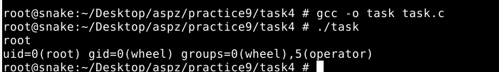

## ЗАВДАННЯ 1:
### Умова:
Напишіть програму, яка читає файл /etc/passwd за допомогою команди getent passwd, щоб дізнатись, які облікові записи визначені на вашому комп’ютері.
 Програма повинна визначити, чи є серед них звичайні користувачі (ідентифікатори UID повинні бути більші за 500 або 1000, залежно від вашого дистрибутива), окрім вас.

### Пояснення та опис програми:

### Результати:

### [Код завдання](task1/task.c)

## ЗАВДАННЯ 2:
### Умова:
Напишіть програму, яка виконує команду cat /etc/shadow від імені адміністратора, хоча запускається від звичайного користувача.
 (Ваша програма повинна робити необхідне, виходячи з того, що конфігурація системи дозволяє отримувати адміністративний доступ за допомогою відповідної команди.)

### Пояснення та опис програми:
### Результати:

### [Код завдання](task2/task.c)

## ЗАВДАННЯ 3:
### Умова:
 Напишіть програму, яка від імені root копіює файл, який вона перед цим створила від імені звичайного користувача. Потім вона повинна помістити копію у домашній каталог звичайного користувача.
 Далі, використовуючи звичайний обліковий запис, програма намагається змінити файл і зберегти зміни. Що відбудеться?
 Після цього програма намагається видалити цей файл за допомогою команди rm. Що відбудеться?
### Пояснення та опис програми:
### Результати:

### [Код завдання](task3/task.c)

## ЗАВДАННЯ 4:
### Умова:
Напишіть програму, яка по черзі виконує команди whoami та id, щоб перевірити стан облікового запису користувача, від імені якого вона запущена.
 Є ймовірність, що команда id виведе список різних груп, до яких ви належите. Програма повинна це продемонструвати.

### Пояснення та опис програми:
### Результати:

### [Код завдання](task4/task.c)

## ЗАВДАННЯ 5:
### Умова:
Напишіть програму, яка створює тимчасовий файл від імені звичайного користувача. Потім від імені суперкористувача використовує команди chown і chmod, щоб змінити тип володіння та права доступу.
 Програма повинна визначити, в яких випадках вона може виконувати читання та запис файлу, використовуючи свій обліковий запис.

### Пояснення та опис програми:

### Результати:

### [Код завдання](task5/task.c)

## ЗАВДАННЯ 6:
### Умова:
 Напишіть програму, яка виконує команду ls -l, щоб переглянути власника і права доступу до файлів у своєму домашньому каталозі, в /usr/bin та в /etc.
 Продемонструйте, як ваша програма намагається обійти різні власники та права доступу користувачів, а також здійснює спроби читання, запису та виконання цих файлів.
### Пояснення та опис програми:

### Результати:

### [Код завдання](task6/task.c)

## ЗАВДАННЯ 7:
### Умова:
Змоделюйте, як cron виконує команду з правами іншого користувача. Коли це не спрацює?

### Пояснення та опис програми:

### Результати:

### [Код завдання](task7/task.c)
